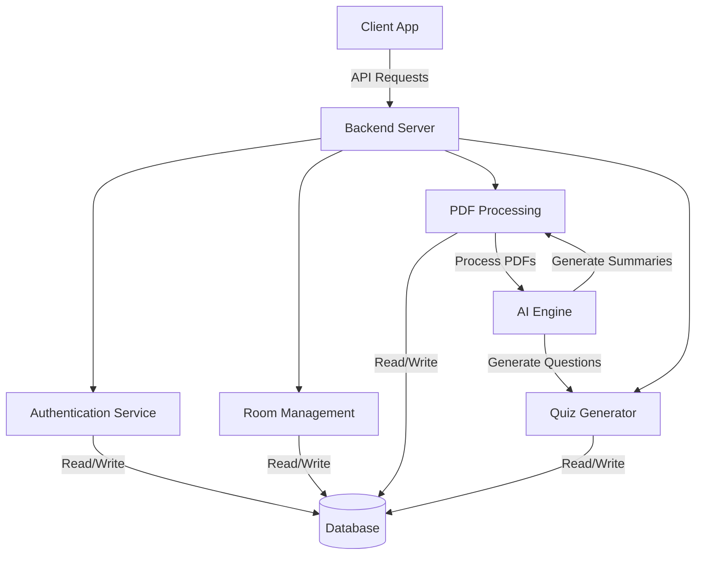

# BRAIN BLOOM

<div align="center">
  
  
  
  
  
  ### *Transform Your Study Sessions with AI-Powered Collaborative Learning*
  
</div>

<p align="center">
  <a href="#-overview">Overview</a> •
  <a href="#-features">Features</a> •
  <a href="#-tech-stack">Tech Stack</a> •
  <a href="#-architecture">Architecture</a> •
  <a href="#-team">Team</a> •
  <a href="#-getting-started">Getting Started</a>
</p>

## 🧠 Overview

**Brain Bloom** revolutionizes group study with an intelligent platform that enables seamless collaboration, AI-driven content processing, and knowledge assessment. Create virtual study rooms, upload and analyze PDFs, generate quizzes instantly, and track learning progress—all in one unified platform.
## 👥 Team

- **Anika Hossain** - ID: 2212736042
- **Mohsin Mullik** - ID: 2132088642
- **Farjana Shakh Alve** - ID: 2013609042
## ✨ Features

- **🔐 Smart Authentication** - Secure signup flow with email verification and OTP protection.
- **🏫 Virtual Study Rooms** - Create or join study rooms by department, course, and topic.
- **📄 AI Document Processing** - Upload PDFs and receive AI-generated summaries and key points.
- **📊 Automated Assessments** - Auto-generated quizzes based on study materials with real-time scoring.
- **👥 Real-time Collaboration** - Study with peers, interact with an AI chatbot, and track progress.
- **📈 Performance Insights** - Monitor quiz scores and rankings within study rooms.

## 🛠 Tech Stack

- **Backend**: Python, Django
- **Frontend**: HTML, CSS, JavaScript
- **Database**: SQLite
- **Authentication**: Django Authentication with OTP verification
- **AI Processing**: Natural Language Processing for document summarization
- **Deployment**: Django-based hosting solutions

## 🏗 Architecture




## 🚀 Getting Started

```bash
# Clone the repository
git clone https://github.com/username/brain-bloom.git

# Navigate to project directory
cd brain-bloom

# Install dependencies
pip install -r requirements.txt

# Apply migrations
python manage.py migrate

# Run development server
python manage.py runserver
```

Visit `http://127.0.0.1:8000` to view the application.

## 📄 License

This project is [MIT](https://opensource.org/licenses/MIT) licensed.

---

<div align="center">
  <p>Made with ❤️ by the Brain Bloom Team</p>
  
  <a href="#BRAIN-BLOOM">Back to top ↑</a>
</div>
